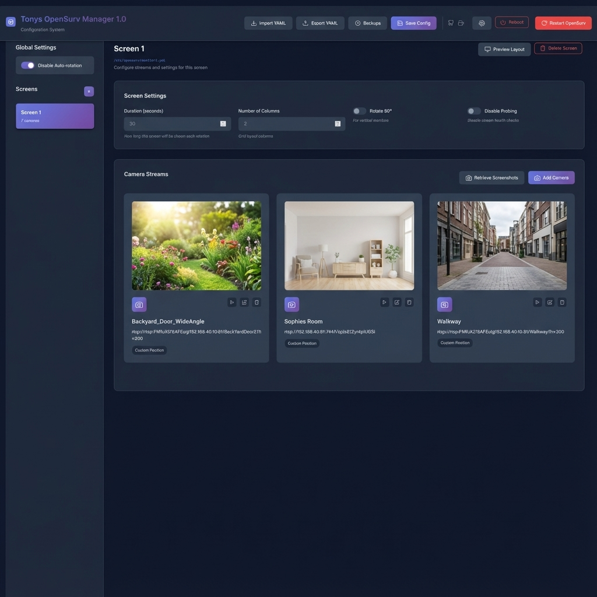
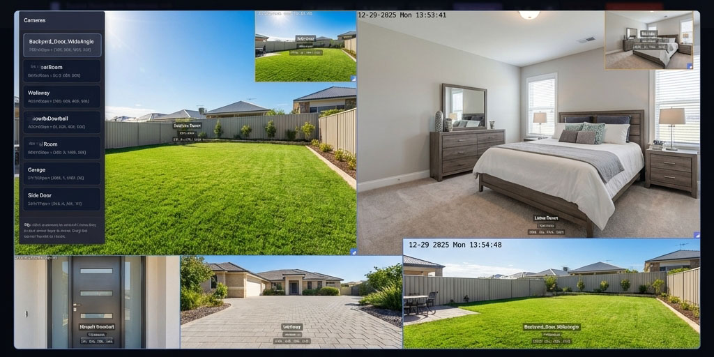

# Tonys OpenSurv Manager 1.6

This is a GUI tool I made to help manage Opensurv YML config files. It's built for Linux but works on Windows too if you just want to edit files.



## What it does

*   **Add cameras with ease**
*   **Drag-and-Drop Editor**: Arrange your camera streams easily.
*   **Live Preview**: Shows you a grid of what your layout will look like.

*   **File Browser**: If you're running this on your server, you can browse folders (like `/etc/opensurv`) and pick YAML files to load.
*   **Auto-Start**: Toggle the system boot service right from the settings.
*   **Backups**: It saves a backup copy every time you save, so you don't lose anything.

## How to Install & Run

### Linux (Recommended)
1.  Clone the repo:
    ```bash
    git clone https://github.com/BigTonyTones/Tonys-OpenSurv-Gui-Editor.git
    cd Tonys-OpenSurv-Gui-Editor
    ```

2.  **Make the server script executable:**
    ```bash
    chmod +x server.py
    ```

3.  Run it with sudo (needed for system services):
    ```bash
    sudo python3 server.py
    ```
    *(It'll ask to install python packages if you're missing any)*

4.  Go to: `http://localhost:6453`

### Windows
Just double-click **`run_windows.bat`**.

Or run it manually:
```cmd
python server.py
```

## Screenshots


## Support

If this saved you some time, feel free to buy me a coffee!

<a href="https://buymeacoffee.com/tonytones" target="_blank"></a>

## License
MIT. Do whatever you want with it.
